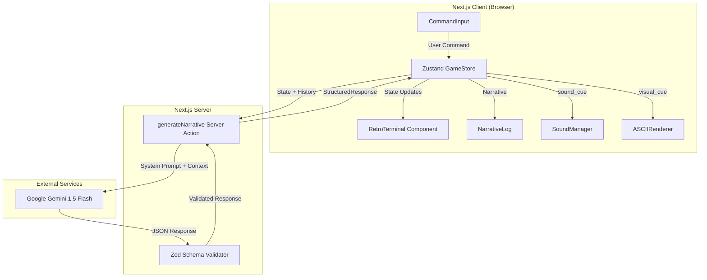
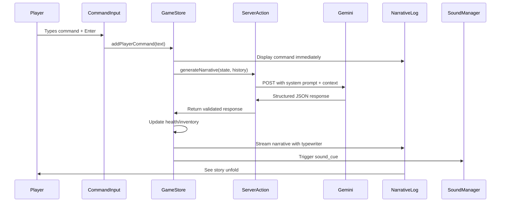
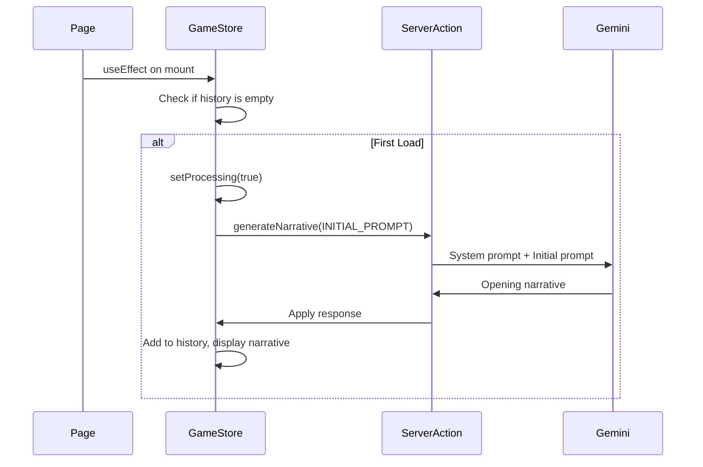
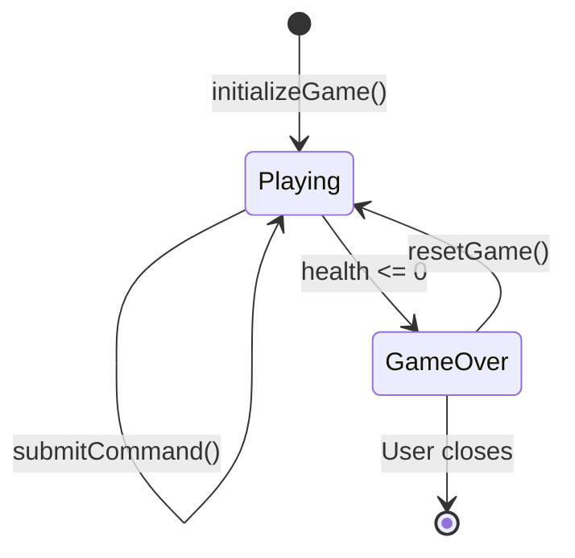

# Design Document

## Overview

Echoes of the Void is a Next.js 15 application that delivers a retro horror text adventure experience through an AI-powered narrative engine. The system combines a visually authentic CRT terminal interface with Google Gemini's language capabilities to create dynamic, responsive storytelling. The architecture follows a client-server pattern where the React frontend manages game state and presentation while Server Actions handle AI communication with strict schema validation.

## Architecture



### Data Flow Sequence



## Components and Interfaces

### Frontend Components

#### RetroTerminal
The root container component that applies all CRT visual effects.

```typescript
interface RetroTerminalProps {
  children: React.ReactNode;
}
```

Responsibilities:
- Apply scanline overlay via CSS pseudo-element
- Apply flicker animation via CSS keyframes
- Apply curved screen effect via border-radius and box-shadow
- Apply phosphor glow via text-shadow on all child text

#### CommandInput
The terminal-style input field for player commands.

```typescript
interface CommandInputProps {
  onSubmit: (command: string) => void;
  disabled: boolean;
  placeholder?: string;
}
```

Responsibilities:
- Auto-focus on mount and after submission
- Clear input after submission
- Show processing indicator when disabled
- Handle Enter key submission

#### NarrativeLog
The scrollable story display area.

```typescript
interface NarrativeLogProps {
  entries: NarrativeEntry[];
  isTyping: boolean;
  onSkipTyping: () => void;
}

interface NarrativeEntry {
  id: string;
  type: 'player' | 'narrator' | 'ascii' | 'system';
  content: string;
  timestamp: number;
}
```

Responsibilities:
- Render entries with appropriate styling per type
- Auto-scroll to bottom on new entries
- Handle typewriter animation state
- Support click-to-skip functionality

#### ASCIIRenderer
Utility component for displaying ASCII art.

```typescript
interface ASCIIRendererProps {
  artKey: VisualCue;
  onComplete?: () => void;
}

type VisualCue = 'none' | 'skeleton' | 'door' | 'chest' | 'monster' | 'void';
```

#### StatusBar
Displays current player state.

```typescript
interface StatusBarProps {
  health: number;
  inventory: string[];
  isGameOver: boolean;
}
```

### State Management

#### GameStore (Zustand)

```typescript
interface GameState {
  // Player State
  health: number;
  inventory: string[];
  isGameOver: boolean;
  
  // Conversation State
  history: ConversationTurn[];
  
  // UI State
  isProcessing: boolean;
  isTyping: boolean;
  narrativeEntries: NarrativeEntry[];
  
  // Actions
  submitCommand: (command: string) => Promise<void>;
  applyStateUpdate: (update: GameStateUpdate) => void;
  addNarrativeEntry: (entry: Omit<NarrativeEntry, 'id' | 'timestamp'>) => void;
  setTypingComplete: () => void;
  resetGame: () => void;
  initializeGame: () => Promise<void>;
}

interface ConversationTurn {
  role: 'user' | 'assistant';
  content: string;
}

interface GameStateUpdate {
  health_change?: number;
  inventory_add?: string;
  inventory_remove?: string;
}
```

### Backend Interfaces

#### Server Action

```typescript
// app/actions/generate-narrative.ts
'use server'

interface GenerateNarrativeInput {
  command: string;
  history: ConversationTurn[];
  playerState: {
    health: number;
    inventory: string[];
  };
}

interface GenerateNarrativeOutput {
  success: boolean;
  data?: StructuredResponse;
  error?: string;
}

async function generateNarrative(
  input: GenerateNarrativeInput
): Promise<GenerateNarrativeOutput>
```

### Utility Services

#### SoundManager

```typescript
// lib/sound-manager.ts
type SoundCue = 'none' | 'wind' | 'scream' | 'drip' | 'combat';

interface SoundManager {
  preloadAll: () => Promise<void>;
  play: (cue: SoundCue) => void;
  setVolume: (volume: number) => void;
}
```

#### ASCII Art Library

```typescript
// lib/ascii.ts
const ASCII_ART: Record<VisualCue, string> = {
  none: '',
  skeleton: `...`,
  door: `...`,
  chest: `...`,
  monster: `...`,
  void: `...`,
};

function getASCIIArt(cue: VisualCue): string;
```

## Data Models

### Zod Schema for AI Response

```typescript
import { z } from 'zod';

export const VisualCueEnum = z.enum([
  'none', 
  'skeleton', 
  'door', 
  'chest', 
  'monster', 
  'void'
]);

export const SoundCueEnum = z.enum([
  'none', 
  'wind', 
  'scream', 
  'drip', 
  'combat'
]);

export const GameStateUpdateSchema = z.object({
  health_change: z.number().optional()
    .describe('Amount to add/subtract from player health. Negative for damage.'),
  inventory_add: z.string().optional()
    .describe('Single item name to add to player inventory.'),
  inventory_remove: z.string().optional()
    .describe('Single item name to remove from player inventory.'),
});

export const StructuredResponseSchema = z.object({
  narrative: z.string()
    .describe('The atmospheric story description based on the player action. 2-4 sentences in dark, horror tone.'),
  visual_cue: VisualCueEnum
    .describe('Key to trigger ASCII art display. Use sparingly for impactful moments.'),
  game_state_update: GameStateUpdateSchema
    .describe('Changes to apply to player state based on story events.'),
  sound_cue: SoundCueEnum
    .describe('Audio atmosphere trigger for immersion.'),
});

export type StructuredResponse = z.infer<typeof StructuredResponseSchema>;
export type VisualCue = z.infer<typeof VisualCueEnum>;
export type SoundCue = z.infer<typeof SoundCueEnum>;
export type GameStateUpdate = z.infer<typeof GameStateUpdateSchema>;
```

### System Prompt Strategy

The AI Dungeon Master requires a carefully crafted system prompt to maintain tone and character consistency.

```typescript
// lib/prompts.ts
export const SYSTEM_PROMPT = `You are the Dungeon Master for "Echoes of the Void," a dark horror text adventure set in an abandoned underground complex. You must NEVER break character or acknowledge being an AI.

## TONE & STYLE
- Write in second person ("You see...", "You hear...")
- Maintain a dark, atmospheric, 80s horror tone reminiscent of classic text adventures like Zork meets Lovecraft
- Use vivid sensory descriptions: sounds, smells, textures, temperature
- Build tension through environmental storytelling
- Keep responses concise: 2-4 sentences maximum
- Never use modern slang or break the period-appropriate atmosphere

## WORLD RULES
- The player explores "The Void" - an ancient underground complex filled with eldritch horrors
- Time moves strangely here; the player's sanity (health) degrades with exposure to horrors
- Items found may be cursed, helpful, or mysterious
- Death is permanent but poetic - describe it atmospherically

## RESPONSE RULES
- Always respond with valid JSON matching the schema
- Use visual_cue sparingly - only for significant discoveries or encounters
- Apply health_change for: combat damage (-10 to -30), horror exposure (-5 to -15), healing items (+10 to +25)
- Use sound_cue to enhance atmosphere at key moments
- If player tries nonsensical actions, redirect them atmospherically within the fiction

## FORBIDDEN
- Never mention being an AI, language model, or assistant
- Never break the fourth wall
- Never refuse a player action - instead, describe why it fails within the fiction
- Never use emoji or modern internet language`;

export const INITIAL_PROMPT = `The player has just awakened in The Void. Generate the opening scene that establishes:
1. The player waking in darkness
2. A sense of disorientation and dread
3. A hint of something watching
4. One possible direction or action to take

This is the START_GAME trigger. Set the tone for the entire experience.`;
```

### Context Builder

```typescript
// lib/context.ts
export function buildContext(
  history: ConversationTurn[],
  playerState: { health: number; inventory: string[] }
): string {
  const recentHistory = history.slice(-10); // Last 5 turns = 10 messages
  
  const stateContext = `
## CURRENT PLAYER STATE
- Health: ${playerState.health}/100 ${playerState.health <= 30 ? '(CRITICAL - describe their weakened state)' : ''}
- Inventory: ${playerState.inventory.length > 0 ? playerState.inventory.join(', ') : 'Empty'}
${playerState.health <= 0 ? '- STATUS: DEAD - Describe their final moments poetically' : ''}

## RECENT HISTORY
${recentHistory.map(turn => `${turn.role.toUpperCase()}: ${turn.content}`).join('\n')}
`;

  return stateContext;
}
```

## Game Loop & State Management

### Initial Game Hook

When the game page loads, the system automatically triggers the prologue:



```typescript
// In GameStore
initializeGame: async () => {
  const state = get();
  if (state.history.length === 0 && !state.isProcessing) {
    set({ isProcessing: true });
    
    const response = await generateNarrative({
      command: '__START_GAME__',
      history: [],
      playerState: { health: 100, inventory: [] }
    });
    
    if (response.success && response.data) {
      get().applyStateUpdate(response.data.game_state_update);
      get().addNarrativeEntry({
        type: 'narrator',
        content: response.data.narrative
      });
      // Handle visual_cue and sound_cue
    }
    
    set({ isProcessing: false });
  }
}
```

### Game Over & Reset Flow



```typescript
// In GameStore
resetGame: () => {
  set({
    health: 100,
    inventory: [],
    isGameOver: false,
    history: [],
    narrativeEntries: [],
    isProcessing: false,
    isTyping: false,
  });
  // Trigger new game initialization
  get().initializeGame();
}

applyStateUpdate: (update: GameStateUpdate) => {
  const state = get();
  let newHealth = state.health;
  let newInventory = [...state.inventory];
  
  if (update.health_change) {
    newHealth = Math.max(0, Math.min(100, state.health + update.health_change));
  }
  
  if (update.inventory_add && !newInventory.includes(update.inventory_add)) {
    newInventory.push(update.inventory_add);
  }
  
  if (update.inventory_remove) {
    newInventory = newInventory.filter(item => item !== update.inventory_remove);
  }
  
  set({
    health: newHealth,
    inventory: newInventory,
    isGameOver: newHealth <= 0,
  });
}
```

### Game Over UI

When `isGameOver` becomes true:
1. Display final narrative with death description
2. Show "GAME OVER" ASCII art
3. Disable command input
4. Show "Press any key to restart" prompt
5. On keypress, call `resetGame()`

## ASCII Art Architecture

ASCII art is stored in a dedicated utility file and mapped by visual cue key:

```typescript
// lib/ascii.ts
export const ASCII_ART: Record<VisualCue, string> = {
  none: '',
  
  skeleton: `
    .---.
   /     \\
   \\.@-@./
    /\`\\_/\`\\
   //  _  \\\\
  | \\     / |
   \\|  |  |/
    |  |  |
   /___|___\\
  `,
  
  door: `
   ______________
  |\\             \\
  | \\             \\
  |  \\-------------\\
  |   |            |
  |   |    .-.     |
  |   |    | |     |
  |   |    '-'     |
   \\  |            |
    \\ |            |
     \\|____________|
  `,
  
  chest: `
      ____
     /    \\
    /______\\
   |  ____  |
   | |    | |
   | |____| |
   |________|
  `,
  
  monster: `
      ,     ,
     /(     )\\
    /  \\   /  \\
   /    ) (    \\
  /   .' _ '.   \\
 /   /   ^   \\   \\
(   (  (o o)  )   )
 \\   \\  \\_/  /   /
  '._/       \\_.'
  `,
  
  void: `
    . . .  .  . . .
   .  *  .   .  *  .
  . .   . . . .   . .
    .  .  ___  .  .
   . . . |   | . . .
  .  *  .|   |.  *  .
   . . . |___|. . .
    .  .  . .  .  .
   .  *  .   .  *  .
    . . .  .  . . .
  `,
};

export function getASCIIArt(cue: VisualCue): string {
  return ASCII_ART[cue] || '';
}

export function hasASCIIArt(cue: VisualCue): boolean {
  return cue !== 'none' && ASCII_ART[cue] !== '';
}
```

The `NarrativeLog` component checks for visual cues and renders them:

```typescript
// When processing AI response
if (response.data.visual_cue !== 'none') {
  get().addNarrativeEntry({
    type: 'ascii',
    content: getASCIIArt(response.data.visual_cue)
  });
}
```


## Correctness Properties

*A property is a characteristic or behavior that should hold true across all valid executions of a system-essentially, a formal statement about what the system should do. Properties serve as the bridge between human-readable specifications and machine-verifiable correctness guarantees.*

Based on the acceptance criteria analysis, the following properties must hold for the system:

### Property 1: Command input clears after submission
*For any* command string submitted through the CommandInput, after submission completes the input field value SHALL be empty and the input SHALL retain focus.
**Validates: Requirements 2.3**

### Property 2: Player commands appear immediately in log
*For any* command submitted by the player, the command text SHALL appear in the NarrativeLog entries before the AI response is received.
**Validates: Requirements 3.3**

### Property 3: Context includes recent history and player state
*For any* conversation history of N turns and any player state (health, inventory), the built context string SHALL contain the last min(N, 10) messages (5 turns) and SHALL contain the current health value and all inventory items.
**Validates: Requirements 4.1, 4.2**

### Property 4: Schema validation ensures response structure
*For any* JSON object, parsing with the StructuredResponseSchema SHALL succeed if and only if the object contains valid narrative (string), visual_cue (valid enum), game_state_update (valid object), and sound_cue (valid enum) fields.
**Validates: Requirements 4.3, 8.2**

### Property 5: Game state serialization round-trip
*For any* valid GameState object, serializing to context string and extracting the values SHALL produce equivalent health and inventory data.
**Validates: Requirements 4.4, 4.5**

### Property 6: Health updates are applied correctly with bounds
*For any* current health value (0-100) and any health_change value, the resulting health SHALL equal max(0, min(100, current + change)).
**Validates: Requirements 5.1**

### Property 7: Inventory add includes new item
*For any* inventory array and any item string to add, the resulting inventory SHALL contain that item.
**Validates: Requirements 5.2**

### Property 8: Inventory remove excludes item
*For any* inventory array containing an item and that item string to remove, the resulting inventory SHALL NOT contain that item.
**Validates: Requirements 5.3**

### Property 9: Game over triggers at zero health
*For any* state update that results in health <= 0, the isGameOver flag SHALL be true.
**Validates: Requirements 5.4**

### Property 10: Sound cue triggers correct audio
*For any* SoundCue value other than 'none', the SoundManager.play function SHALL be called with that cue value.
**Validates: Requirements 6.1**

### Property 11: Visual cue maps to correct ASCII art
*For any* VisualCue value other than 'none', the getASCIIArt function SHALL return a non-empty string corresponding to that cue.
**Validates: Requirements 7.1**

## Error Handling

### AI Response Errors

When the AI returns an invalid response or the request fails:

```typescript
// In Server Action
try {
  const { object } = await generateObject({
    model: google('gemini-1.5-flash'),
    schema: StructuredResponseSchema,
    system: SYSTEM_PROMPT,
    prompt: buildContext(input.history, input.playerState) + '\n\nPlayer: ' + input.command,
  });
  
  return { success: true, data: object };
} catch (error) {
  console.error('AI generation failed:', error);
  
  // Return fallback response
  return {
    success: true,
    data: {
      narrative: 'The void shifts around you, reality flickering for a moment. You sense something went wrong in the fabric of this place...',
      visual_cue: 'none',
      game_state_update: {},
      sound_cue: 'wind',
    }
  };
}
```

### Network Errors

- Display "Connection lost to The Void..." message
- Retry automatically up to 3 times with exponential backoff
- After retries exhausted, show retry button

### Invalid User Input

- Empty commands: Ignore silently, keep focus on input
- Very long commands (>500 chars): Truncate before sending to AI
- Special characters: Allow all - the AI handles interpretation

## Testing Strategy

### Property-Based Testing

The system uses `fast-check` as the property-based testing library for TypeScript/JavaScript.

Each property-based test MUST:
- Run a minimum of 100 iterations
- Be tagged with a comment referencing the correctness property: `**Feature: echoes-of-the-void, Property {number}: {property_text}**`
- Generate appropriate random inputs using fast-check arbitraries

Key areas for property testing:
- **Context Builder**: Generate random histories and player states, verify output contains required data
- **Schema Validation**: Generate valid/invalid JSON objects, verify parse success/failure
- **State Updates**: Generate random health values and changes, verify bounds and calculations
- **Inventory Operations**: Generate random inventories and items, verify add/remove behavior
- **ASCII Art Mapping**: Generate all valid visual cues, verify non-empty returns

### Unit Testing

Unit tests complement property tests by covering:
- Specific edge cases (empty inventory, zero health, max health)
- Integration points (Server Action invocation, Zustand store updates)
- Error handling paths (network failures, invalid responses)
- UI component rendering (StatusBar displays correct values)

### Test File Structure

```
src/
├── lib/
│   ├── __tests__/
│   │   ├── context.test.ts        # Context builder tests
│   │   ├── context.property.test.ts
│   │   ├── schema.test.ts         # Schema validation tests
│   │   ├── schema.property.test.ts
│   │   ├── ascii.test.ts          # ASCII art mapping tests
│   │   └── ascii.property.test.ts
├── store/
│   ├── __tests__/
│   │   ├── game-store.test.ts     # Store action tests
│   │   └── game-store.property.test.ts
└── components/
    └── __tests__/
        ├── CommandInput.test.tsx
        ├── StatusBar.test.tsx
        └── NarrativeLog.test.tsx
```

### Testing Commands

```bash
# Run all tests
npm test

# Run property tests only
npm test -- --grep "property"

# Run with coverage
npm test -- --coverage
```
